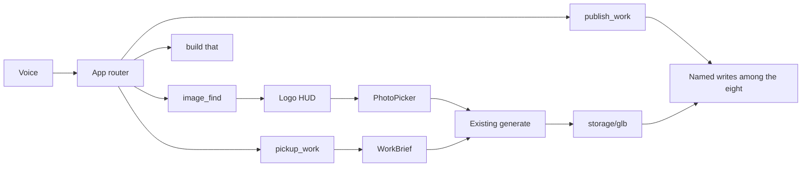
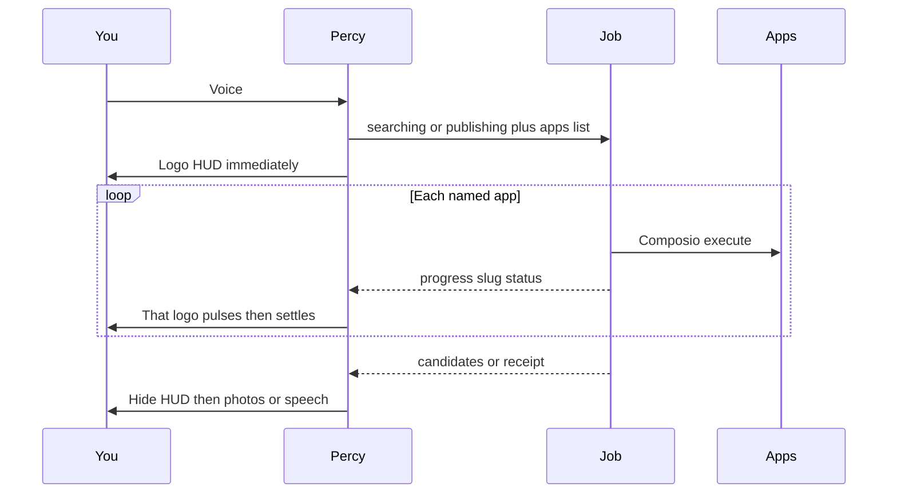

# Composio pickup and publish

Voice-routed Composio loop on **eight connected apps**. Percy’s backend calls those APIs (not Cursor MCP). A logo HUD on Quest and desktop is the product showcase while each app runs, then photos or a spoken receipt.

**Status:** plan only — do not implement until the open questions at the bottom are answered.

---

## Locked scope (v1)

Only the eight apps that are Active in the Composio dashboard. Slack, Outlook, Teams, Dropbox, Linear, Jira, and Docs are **out of v1**. If the user names Slack (or any other disconnected app), Percy says it is not connected.

---

## The eight

| App | Pickup | Images | Publish |
|---|---|---|---|
| Gmail | Fetch mail / CAD requests | Image attachments | Email “done” + Drive link |
| Google Drive | Spec docs | `image/*` files | Upload/share GLB |
| Google Photos | — | Primary photo search | Optional album later; skip v1 write |
| Google Calendar | Due date into the brief | — | Optional “delivered” event if they ask |
| Google Sheets | BOM / dimensions | — | Write/update a size table if they ask |
| Notion | Design notes / spec | — | Append “built” + link (not the GLB) |
| GitHub | Issue / PR text | Repo images if any | Commit CadQuery script or comment on the issue |
| Figma | Frame comments as spec | Export PNG/JPG as CAD ref | — |

**Image-find set:** Photos, Drive, Figma, Gmail attachments.

**Pickup set** (unnamed “what should I work on”): Gmail, Notion, GitHub, Calendar, Sheets, Drive docs.

**Publish set:** Gmail, Drive, Notion, GitHub, Calendar, Sheets — only those named in the utterance.

Keep [`backend/photos/drive.py`](backend/photos/drive.py) as the public-folder fallback when Composio Drive is empty or down.

---

## Flagship photo use case

> “Hey Percy, go through all of my photos across all apps and find this really cute picture of Pikachu. I wanna make a keychain out of it.”

- Intent: **image-find**
- Apps: Photos + Drive + Figma + Gmail images (the connected image set)
- HUD shows those logos first, then PhotoPicker, then pinch → existing `build_from_image`

---

## Product: showcasing the API calls

The HUD’s job is to **cover the silence** while Composio runs (5–15s). It should feel cool, not like a spinner in a status bar. Logos in motion = “Percy is working.” Stillness = we failed the wait.

### Prod rule: say the app, see the app

If the user names one of the eight connected apps, Percy fetches **that app** and **displays** the result. Voice confirms; the headset/desktop must show it.

Starter commands:

| User says | App | After the logo HUD |
|---|---|---|
| “Pull up my Google Drive photos” | Drive | PhotoPicker of their Drive images |
| “Pull up my Google Photos” | Photos | PhotoPicker |
| “Pull up Notion” | Notion | Page cards (title + snippet) |
| “Pull my last email” | Gmail | One email card: from, subject, snippet — not voice-only |

Named but not connected → “I don’t have Slack connected.”

### One HUD, four captions

Same component, different copy:

| Lane | Caption while running | After HUD hides |
|---|---|---|
| Image-find / Drive / Photos | “Looking through your photos…” | PhotoPicker cards only. No logos mixed with pictures. |
| Email / Notion / items | “Opening Gmail…” / “Opening Notion…” | Item cards on screen. |
| Pickup | “Checking what the team asked for…” | Spoken brief and/or item cards. |
| Publish (after the GLB exists) | “Sending this out…” | Percy speaks “sent.” Model stays in the room. |

Only **this turn’s** apps appear. Pikachu across all photos → Photos, Drive, Figma, Gmail. “Email Gmail, Drive, and Notion” → those three, not Calendar or GitHub.

### Chip states

Each brand mark is a circle (local SVG in `web-client/src/brands/`, not hotlinked):

| State | Look |
|---|---|
| Queued | Dim, waiting |
| Live | Pulse / slow orbit. Caption names that app (“Google Photos…”) |
| Done | Full opacity, short settle |
| Empty | Dim again (searched, nothing matched) |
| Error | Muted; Percy can mention it in the spoken line later |

Do not wait for every app to finish before *animating*. The showcase is watching them go live one after another (parallel under the hood; UI can still highlight whichever just flipped to live). Do wait for the **image job to finish** before showing any photo cards.

### Desktop

Fixed overlay on `#overlay` in [`web-client/index.html`](web-client/index.html), above the Three canvas, `pointer-events: none`. Horizontal row of chips + one caption. Visible in Chrome preview and still readable if the debug HUD is off. This is how we film/debug without a headset.

### Quest

Same data, world-space chips ~0.75 m in front of the camera (same idea as [`PhotoPicker`](web-client/src/PhotoPicker.js) `PLACE_DIST`). They face the user. When the job is `find_photos`, **destroy the logo group first**, then spawn photo cards in that same slot so it feels like search turning into results.

Publish: logos float in front of the finished keychain, then disappear when TTS starts.

### What we will not do

- Status-bar text as the only “animation”
- All eight logos when the user named two
- Cursor MCP or a Composio dashboard in the headset
- Photo cards while any image API is still running

**Wire:** first HTTP response `action: searching|publishing`, `job_id`, `apps: [{slug,label,status}]`. Poll [`/api/jobs/{id}`](backend/app/jobs.py) for `progress.apps`. Percy already polls photo builds; extend that to this HUD.

---

## Voice routing

Named apps among the eight only.

- “All my photos” → image-find set
- Unnamed pickup → pickup set
- Named-but-not-in-the-eight → “I don’t have Slack connected.”

Demo lines (no Slack):

- “Pull in Gmail, Notion, and GitHub and figure out what I need to work on.”
- “Email the team on Gmail, put the model in Drive, and add a Notion note that this is completed.”

---

## Code shape

`backend/composio/` adapters **only** for: `gmail`, `googledrive`, `googlephotos`, `googlecalendar`, `googlesheets`, `notion`, `github`, `figma`.

Same wiring:

- [`backend/ai/intent.py`](backend/ai/intent.py) — Composio intents **before** the old Drive photo regex
- [`backend/app/pipeline.py`](backend/app/pipeline.py)
- [`backend/app/models.py`](backend/app/models.py)
- [`backend/app/jobs.py`](backend/app/jobs.py)
- [`web-client/src/voice/PercyAssistant.js`](web-client/src/voice/PercyAssistant.js)
- `web-client/src/SearchHUD.js` + AR chips

Python package: `composio`. Brand marks: `web-client/src/brands/` for these eight only.

---

## Env / dashboard

- Valid **project** `COMPOSIO_API_KEY` in `backend/.env` (a chat `ck_` key 401’d). Cursor MCP login is **not** the backend key.
- `COMPOSIO_USER_ID` matching the dashboard user who owns these eight ACTIVE accounts.
- Allowlist is only the eight connected apps.

---

## Build order

Do not start until env + seed questions are answered.

0. Project API key in `.env`; confirm these eight stay ACTIVE
1. Router + HUD + job progress
2. Image-find across Photos / Drive / Figma / Gmail → picker → keychain
3. Pickup from Gmail / Notion / GitHub / Calendar / Sheets / Drive
4. Publish to named Gmail / Drive / Notion / GitHub
5. “Build that” from `last_brief`

---

## Implementation todos

| ID | What |
|---|---|
| `env-composio` | `COMPOSIO_API_KEY` / `USER_ID` in `.env`; allowlist is only the eight; install `composio` — **done on the env-key side except a valid project API key** |
| `source-router` | Route named apps vs all-my-photos vs unnamed pickup against the eight-app allowlist only |
| `composio-package` | Adapters only for Gmail, Drive, Photos, Calendar, Sheets, Notion, GitHub, Figma |
| `job-progress` | Jobs expose per-app `searching` / `done` / `error` for the logo HUD |
| `search-hud` | Logo HUD covers Composio wait on desktop and AR; pulse live chips; hide then PhotoPicker or TTS |
| `image-sources` | All-apps Pikachu search across Photos, Drive, Figma, Gmail attachments; public-folder Drive as fallback |
| `intent-pipeline` | `pickup_work`, `publish_work`, image-find before the old Drive regex |
| `percy-jobs` | Percy polls `job_id`; HUD then candidates or spoken brief/receipt |
| `build-from-brief` | “Yeah build that” uses `last_brief`; pinched photo uses `build_from_image` |
| `seed-demo` | Put Pikachu in Photos and Drive; optional Figma frame; Gmail / Notion / GitHub sample CAD request |

---

## Demo script

1. All-apps Pikachu → Photos / Drive / Figma / Gmail logos → card → pinch → sculpt.
2. “Check Gmail, Notion, and GitHub for what I should pick up.”
3. “Yeah, build that.”
4. “Email Gmail, upload to Drive, and note it in Notion.” → those three logos → spoken done.

---

## Open before build

See the questions in chat. Do not implement this plan until those are answered.
