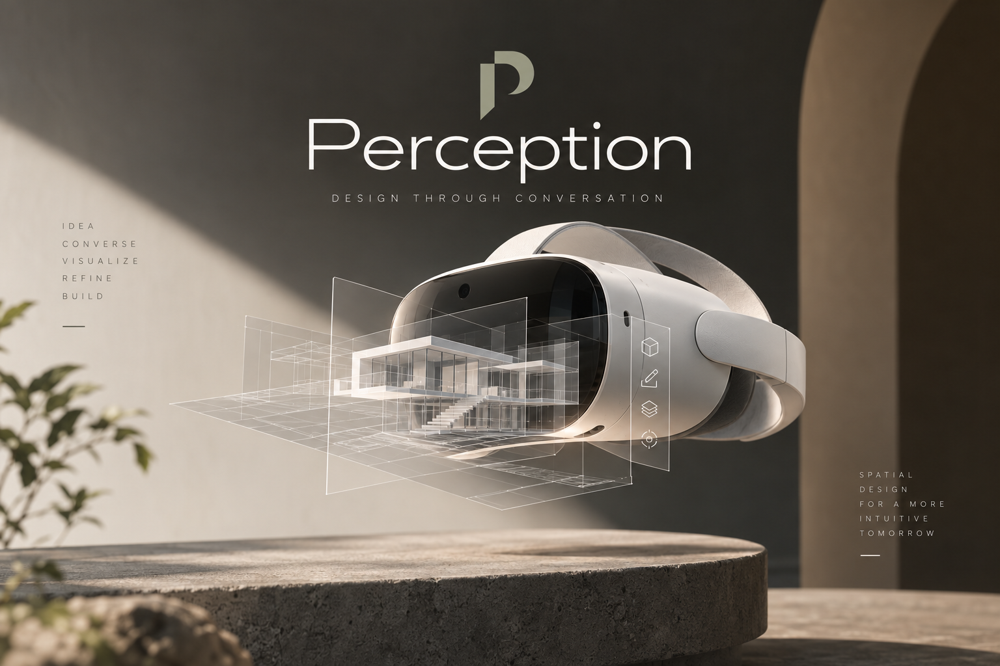
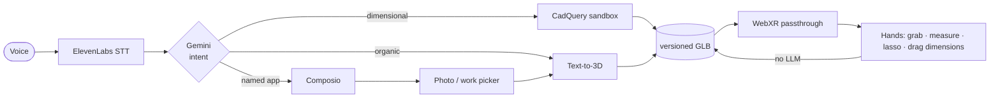

<div align="center">



<br><br>

**Say it. Watch it appear in your room. Reach out and change it.**

Voice-driven CAD in passthrough AR on Meta Quest 3 — real parametric geometry, in your hands.

<br>


</div>

---

## The loop

<div align="center">

|  **Idea**  |  **Converse**  |  **Visualize**  |  **Refine**  |  **Build**  |
|:---:|:---:|:---:|:---:|:---:|
| Hold to talk | Percy parses intent | Model lands in your room | Hands, not menus | STL / STEP / GLB out |
| *"a 12-tooth gear"* | CAD or sculpt | passthrough AR | drag a dimension | printable |

</div>

Two engines behind one sentence. **Dimensional, printable parts** go to a CadQuery sandbox that emits a script with its sizes declared up front — so *"make the ears 4 mm longer"* is a parameter rewrite, not a re-roll. **Organic, characterful things** go to text-to-3D (three.ws, NVIDIA TRELLIS, or Meshy). Percy picks; you just talk.

---

## Quickstart

<table>
<tr><td width="50%" valign="top">

**1 · Backend**

```bash
python3 -m venv .venv
.venv/bin/pip install -r backend/requirements.txt

cp backend/.env.example backend/.env   # add keys
cd backend
PYTHONPATH=. uvicorn app.main:app \
  --host 0.0.0.0 --port 8000
```

</td><td width="50%" valign="top">

**2 · Client**

```bash
cd web-client
npm install
npm run dev
```

HTTPS is on by default — WebXR needs it.
Open `https://<your-ip>:5173` in the
Quest Browser and tap **Enter AR**.

</td></tr>
</table>

> [!TIP]
> Find your IP with `ipconfig getifaddr en0`. Quest and dev machine must share a network, and you'll have to accept the self-signed certificate once.

**Desktop preview** — same server, opened at `https://localhost:5173`, boots the IWER Quest 3 emulator. Hold **Space** to talk.

---

## Talking to Percy

Hold **left trigger** (or left pinch, or the on-screen **Hold** button, or **Space**) — speak — release.

| Say this | What happens |
|:---|:---|
| *"build me a 12-tooth gear"* | CadQuery part, dimensioned and printable |
| *"build me a Pikachu keychain"* | CadQuery charm with a lug hole |
| *"make me a toy car"* | Text-to-3D sculpt |
| *"make the ears longer"* | Rewrites one named dimension — no re-generation |
| *"add a hole for a keychain"* | Boolean feature on the same object |
| *"make it twice as big"* | CAD rescales dimensions; a sculpt re-sizes |
| *"paint it gold"* / *"make it navy"* | Recolor and rebuild |
| *"change the color"* | Percy asks which one |
| *"find that photo of Pikachu in my photos"* | Searches connected apps, opens the AR photo carousel |
| *"what should I work on?"* | Pulls a brief from Gmail / Notion / GitHub / Calendar |
| *"publish this to the repo"* | Writes back to the app you named |

---

## Controls

<table>
<tr><th align="left">Hands & controllers</th><th align="left">Desktop</th></tr>
<tr><td valign="top">

| Do | Get |
|:---|:---|
| Hold **left trigger** / left pinch | Push to talk |
| **Right pinch** near the model | Grab, move, spin |
| **Both hands** pinch | Zoom, yaw, reposition *(view only)* |
| Off-hand pinch while dragging | Fine mode — 0.1× movement |
| Pinch-drag a dimension row | Live parametric resize |
| Pinch two surface points | Tape measure |
| Right-pinch stroke on the model | Lasso a region to edit |
| Hold **left Y** for 1s | Full session reset (with a filling cue) |

</td><td valign="top">

| Key | Action |
|:---:|:---|
| `Space` | Hold to talk |
| `M` | Mute |
| `T` | Tape measure |
| `V` | Select / lasso mode |
| Scroll | Zoom |

</td></tr>
</table>

---

## How it fits together



The fast path matters: a hand edit on a named dimension is a **~67 ms** round trip, against ~15 s for the same change through codegen. Long image-to-3D builds run **detached** and the client polls — a dropped headset connection costs one poll, not the model.

<details>
<summary><b>Repository layout</b></summary>

```
backend/
  app/            FastAPI routes, pipeline, sessions, detached jobs
    projects.py   Per-object version history — undo/redo over GLBs
  cad/            CadQuery builder, sandbox, PARAMS read/rewrite, STL/STEP export
  mesh/           Text-to-3D factories, boolean features, semantic sculpt edits
  ai/             Intent parsing + CAD/mesh routing
  voice/          ElevenLabs STT / TTS
  photos/         Drive search, subject isolation, staging
  composio_app/   Eight-app voice router: pickup, image-find, publish

web-client/src/
  main.js               WebXR scene, hands, model interaction
  voice/
    VoiceState.js       idle │ listening │ thinking │ speaking │ error │ muted
    PTTRecorder.js      Hold-to-talk MediaRecorder
    PercyAssistant.js   Orchestrator
  interaction/          Pure, Node-testable math:
    measure · twoHand · selection · regionOps · paramPanel · partEdit
    tapeMeasure · viewCapture · resetHold · pttSource · frameGuard
  PhotoPicker.js · ItemPicker.js · SearchHUD.js
```

Everything in `interaction/` avoids importing Three.js so the math runs — and is tested — in plain Node.

</details>

---

## Connected apps

Eight apps are wired through Composio. Percy routes by name, shows a logo HUD while each one runs, then hands back photos or a spoken receipt.

<div align="center">

| | | | | | | | |
|:---:|:---:|:---:|:---:|:---:|:---:|:---:|:---:|
| Gmail | Drive | Photos | Calendar | Sheets | Notion | GitHub | Figma |

</div>

**Pickup** — Gmail, Notion, GitHub, Calendar, Sheets, Drive. **Image-find** — Photos, Drive, Figma, Gmail attachments. **Publish** — only the app you name. Anything else (Slack, Linear, Jira…) gets an honest *"that's not connected."*

---

## API

<details open>
<summary><b>Endpoints</b></summary>

| Method | Endpoint | Description |
|:---|:---|:---|
| `GET` | `/api/health` | System status, CAD + mesh provider readiness |
| `GET` | `/api/greet` | Deterministic, no-LLM greeting on entering AR |
| `POST` | `/api/command` | Text command — `{text, session_id}` |
| `POST` | `/api/voice` | Voice command — multipart audio (+ optional selection) |
| `POST` | `/api/script` | Run a CadQuery script in the sandbox |
| `POST` | `/api/image` | Image-to-3D — returns a job id |
| `GET` | `/api/jobs/{id}` | Poll a detached build |
| `GET` | `/api/session/{id}` | Session state |
| `POST` | `/api/session/{id}/reset` | Wipe the session |
| `GET` | `/api/projects/{id}` | Version history (read-only) |
| `POST` | `/api/projects/{id}/undo` · `/redo` | Step through versions |
| `POST` | `/api/projects/{id}/versions` | Save a hand-edited GLB as a new version |
| `POST` | `/api/projects/{id}/params` | Rewrite named dimensions, rerun — no LLM |
| `POST` | `/api/projects/{id}/resize` | Two-hand-stretch release → real-size rescale |
| `POST` | `/api/projects/{id}/semantic_edit` | Edit a render inside a circled region, re-sculpt |
| `GET` | `/api/photos/{file_id}/preview` | Same-origin photo for the AR picker |
| `POST` | `/api/photos/confirm` · `/choose` | Confirm, then build the picked photo |

</details>

<details>
<summary><b>Script execution (codegen integration)</b></summary>

```bash
curl -X POST http://localhost:8000/api/script \
  -H "Content-Type: application/json" \
  -d '{
    "script": "import cadquery as cq\nresult = cq.Workplane(\"XY\").box(20, 20, 10)",
    "session_id": "default",
    "color": "#FFD700"
  }'
```

Scripts run sandboxed: **30 s timeout**, no filesystem, no network, memory limits, and non-manifold meshes rejected.

Named dimensions travel with the script as a module-level literal, which is what makes hand edits instant:

```python
PARAMS = {"ear_length_mm": 16, "head_radius_mm": 16}
```

`cad/params.py` reads and rewrites that literal with `ast` plus text splicing — **never by executing the script** — so it is safe on untrusted code and fast enough to run on every drag.

</details>

<details>
<summary><b>VoiceState hooks (for in-world HUD)</b></summary>

```javascript
import { voiceState, VoiceStates } from './voice/VoiceState.js';

voiceState.subscribe(({ state, isMuted, errorMessage }) => {
  // 'idle' | 'listening' | 'thinking' | 'speaking' | 'error' | 'muted'
  updateHudIndicator(state);
});

if (voiceState.isListening) { /* show recording indicator */ }
voiceState.toggleMute();
```

Also exposed as `window.voiceState`.

</details>

---

## Configuration

Copy `backend/.env.example` to `backend/.env`:

```bash
# Voice
ELEVENLABS_API_KEY=            # STT + TTS
DEEPGRAM_API_KEY=              # optional, better STT

# Intent, codegen, semantic edits (one of)
GEMINI_API_KEY=                # preferred — free-tier friendly
OPENAI_API_KEY=

# Text-to-3D — any one works; three.ws needs no key
NVIDIA_API_KEY=                # free TRELLIS
MESHY_API_KEY=                 # optional, paid
HF_TOKEN=                      # optional, raises ZeroGPU budget

# Connected apps + photo search (optional)
COMPOSIO_API_KEY=
COMPOSIO_USER_ID=
GOOGLE_DRIVE_API_KEY=
GOOGLE_DRIVE_FOLDER_ID=        # empty = photo search off
```

---

## Tests

```bash
./run_tests.sh
```

Backend suites run on the project venv (`.venv`) so missing deps report honestly instead of as phantom failures. Client suites are plain `node` — the interaction math is pure by design.

---

## Troubleshooting

| Symptom | Fix |
|:---|:---|
| **"API offline"** | Backend isn't up on port 8000 |
| **Nothing happens on hold** | Allow the microphone; hold longer than a tap |
| **Certificate error** | Accept the self-signed cert in Quest Browser |
| **Mic blocked** | Quest Settings → Apps → Browser → Permissions |
| **Model not appearing** | Look forward after entering AR |
| **Build never lands** | It's detached — check `GET /api/jobs/{id}` |

<div align="center">
<br>
<sub><b>Perception</b> · spatial design for a more intuitive tomorrow</sub>
</div>
